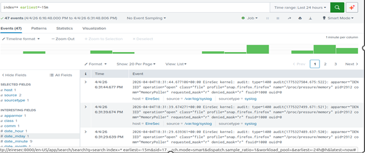
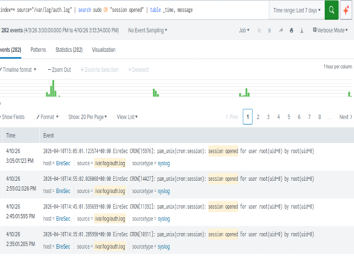
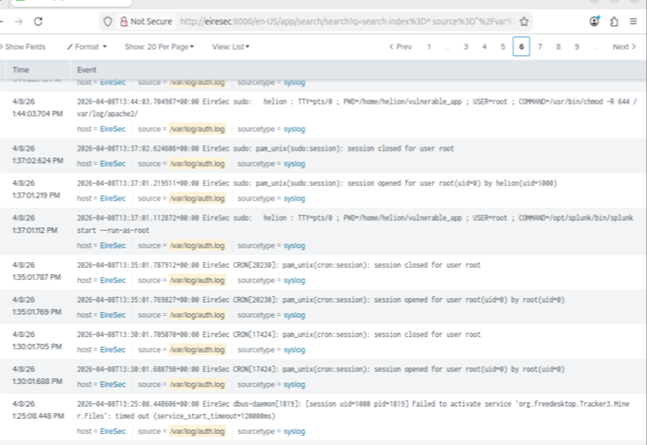
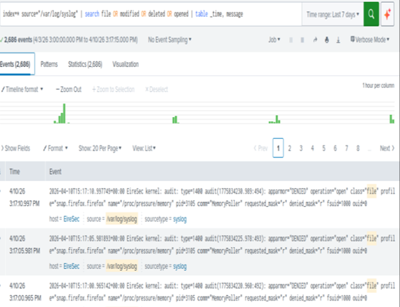

# EireSec Intrusion Detection

## Overview
This project simulates a vulnerable server environment and demonstrates how cyber attacks can be detected using Splunk SIEM.

## Project Scope
- Vulnerable web application (Flask)
- Multi-user Linux environment
- Simulated cyber attacks (SQL injection, privilege escalation)
- Log analysis and intrusion detection

## My Contribution (Task 3)
I was responsible for **Detection and Evidence Collection using Splunk SIEM**.
### What I did:
- Installed and configured Splunk
- Integrated log sources:
  - /var/log/auth.log
  - /var/log/syslog
  - Apache logs
- Created baseline system activity
- Analysed post-attack logs
- Identified indicators of compromise

## Key Findings
- Baseline: 47 events
- Attack: 4,453 events
- Detected:
  - Repeated root session activity
  - Suspicious HTTP requests
  - AppArmor DENIED logs
  - Privilege escalation patterns

## Tools Used
- Ubuntu Server
- Splunk SIEM
- Python Flask
- Linux Logs

## Screenshots

### Baseline Activity

### Post-Attack Activity

### Authentication Logs

### System Logs (AppArmor)

## Splunk Analysis

Detailed detection queries and analysis:

[View Splunk Detection & Analysis](splunk/splunk-search-queries.md)
## Disclaimer
This project was conducted in a controlled lab environment for educational purposes only.
